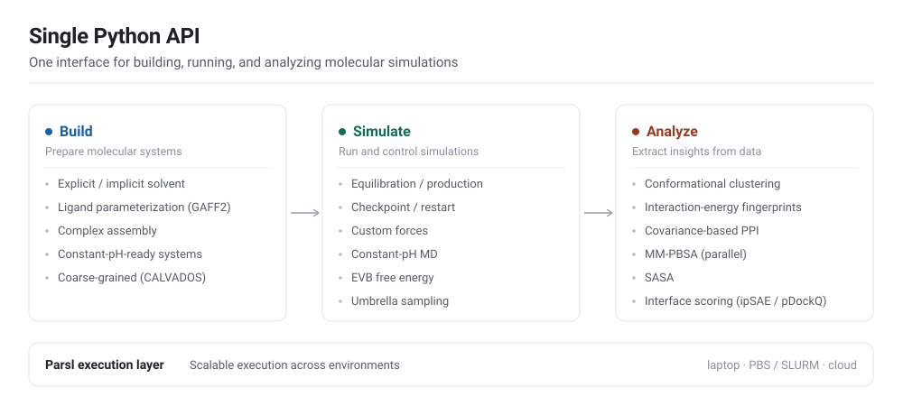

# Summary

*molecular-simulations* is a Python toolkit for building, running, and analyzing molecular dynamics (MD) simulations using the AMBER force-field ecosystem with OpenMM as the simulation engine, and Parsl as the workflow layer for scalable execution on HPC systems.
The package provides end-to-end components that reduce the friction of going from an input structure to AMBER-compatible system files, GPU-accelerated MD with restartable protocols, and analysis routines commonly used in characterizing biomolecular simulations.
By covering the full arc from preparation through analysis behind a single Python API, it lets researchers treat a simulation campaign as one reproducible program rather than a chain of hand-managed scripts.

The package is organized around three stages that mirror the lifecycle of an MD study (\autoref{fig:architecture}):

- **Build.** System preparation via AmberTools for explicit- and implicit-solvent setups (default ff19SB protein parameters and OPC water) [@tian2020ff19sb; @izadi2014opc], small-molecule parameterization with GAFF2 and AM1-BCC charges [@wang2004gaff; @jakalian2002am1bcc], complex assembly, constant-pH-ready builds, and coarse-grained construction for the CALVADOS model [@von2025software].
- **Simulate.** OpenMM-based drivers standardizing equilibration and production protocols with checkpoint/restart, straightforward injection of custom forces, constant-pH MD, Empirical Valence Bond (EVB) free-energy calculations [@warshel1980evb], umbrella sampling with MBAR/WHAM free-energy estimation [@shirts2008mbar; @kumar1992wham], and coarse-grained/multi-resolution simulation.
- **Analyze.** Automated routines for conformational clustering, protein–protein interaction characterization, interaction-energy fingerprinting, covariance-based attractive/repulsive interaction detection [@golcuk2025practical], solvent-accessible surface area via the Shrake–Rupley algorithm [@shrake1973sasa], parallel MM-PBSA binding free energies [@miller2012mmpbsa], and interface scoring — ipTM [@evans2021afmultimer; @zhang2004tmscore], ipSAE [@dunbrack2025res], pDockQ [@bryant2022pdockq], pDockQ2 [@zhu2023pdockq2], and LIS [@kim2024lis].

The package also ships agent-loadable *skills* — self-contained tool descriptions, one per stage — so it can be driven directly by language-model agents and tool-calling frameworks without a bespoke wrapper.

# Statement of need

Modern biomolecular MD projects frequently require *ensembles* of simulations across multiple systems (e.g., homologs, mutants, complexes, or replicate trajectories) coupled to custom analyses.
In practice, this workflow often becomes a collection of bespoke scripts spanning structure cleanup, force-field assignment, solvation and ion placement, simulation protocol execution, checkpoint/restart management, and post-processing.
Each of these steps carries its own conventions and failure modes, and the glue between them is rarely captured anywhere durable.
This ad hoc approach makes it difficult to scale from a single workstation run to a production campaign on an HPC cluster or cloud resource while preserving reproducibility and provenance.

The problem is compounded by the layer at which most researchers work.
Preparation is typically driven through AmberTools' interactive utilities, execution through hand-written OpenMM scripts, and analysis through a separate stack (MDAnalysis, cpptraj, in-house code).
Reproducing a result months later, or handing a campaign to a collaborator, then depends on tacit knowledge of which script was run in which order with which arguments.
As datasets and the number of systems under study grow, this friction can become the dominant cost of a project rather than the science itself.

*molecular-simulations* addresses this need by providing:

1. **System building utilities** that automate common AMBER/AmberTools preparation steps (including explicit and implicit solvent workflows, complex assembly, ligand parameterization, and constant-pH-ready builds).
2. **Simulation drivers** built on OpenMM that standardize equilibration/production protocols with restart support and enable easy integration of custom forces and free-energy methods.
3. **HPC-ready execution** using Parsl, including reusable configuration objects for local execution and PBS-style clusters, so the same code scales from a laptop to a supercomputer.
4. **Integrated analysis** routines focused on clustering and protein–protein interaction characterization, including energetic and structural metrics frequently used to rank and interpret interfaces.

Because every stage is expressed in a single Python API, an entire campaign — build, simulate, analyze — can be written, version-controlled, and re-executed as one program, improving both reproducibility and provenance relative to a directory of loosely coupled scripts.

# State of the field

Several software packages address aspects of MD workflow management and HPC execution.

For GROMACS users, `gmxapi` provides a Python interface enabling programmatic control of simulations, including custom stopping conditions and user plugins within force calculations [@irrgang2022gmxapi; @irrgang2018gmxapi].
However, `gmxapi` operates within a single job allocation, limiting its applicability to multi-node campaigns spanning multiple scheduler submissions.
The recently published `asyncmd` package [@jung2025asyncmd] extends GROMACS workflows across job boundaries using Python's async/await syntax, with a focus on providing building blocks for trajectory-based enhanced sampling algorithms such as transition path sampling and weighted ensemble methods.
While `asyncmd` excels at dynamic stopping conditions and adaptive sampling workflows, it currently supports only the SLURM scheduler and does not include system preparation or post-simulation analysis capabilities.

General-purpose workflow frameworks such as AiiDA [@huber2020aiida] and signac/row [@adorf2018signac] enable reproducible computational workflows with automatic provenance tracking.
These tools prioritize data management over MD-specific functionality; for instance, AiiDA lacks native support for GPU resource requests, and MD integration requires additional plugins.

*molecular-simulations* occupies a complementary niche by providing an end-to-end toolkit spanning system preparation through analysis, with a focus on the AMBER/OpenMM ecosystem.
Unlike orchestration-focused tools, it includes system builders (explicit/implicit solvent, ligand parameterization), standardized simulation protocols with custom force injection, and integrated analysis routines (clustering, MM-PBSA, interaction fingerprinting, interface scoring).
The use of Parsl for workflow execution provides scheduler-agnostic HPC support (SLURM, PBS, AWS, Google Cloud, and others) while maintaining a simple Python API, enabling users to scale from local prototyping to production campaigns with minimal code changes.

None of the tools above delivers the specific combination this package targets: AMBER/OpenMM system preparation, GPU MD with in-process custom-force and free-energy support, and the analysis routines needed to interpret an interaction, all callable from one Python API and portable across schedulers.
Composing existing tools to reach that combination would mean gluing together four separate contracts and failure modes — precisely the ad hoc pipeline described above — so we built a cohesive toolkit instead; the scholarly contribution is the integrated, reproducible arc from structure to interpreted result, together with analyses (e.g., per-residue interaction-energy decomposition in OpenMM) that are otherwise not available out of the box.

# Software design

The central design decision is to separate the lifecycle into three loosely coupled stages — build, simulate, analyze — that communicate through files in standard formats (AMBER topologies/coordinates, OpenMM checkpoints, trajectories) rather than through shared in-memory state.

OpenMM was chosen as the simulation engine specifically because it is performant, Python-native, and enables easy extension and adoption of new algorithms and techniques.
This makes it possible to inject custom forces, per-residue energy decomposition, constant-pH moves, and EVB/umbrella-sampling terms in-process.
AMBER/AmberTools handles preparation for the same reason of leverage — we standardize and script community-validated tooling rather than reimplement force-field assignment and solvation.

For execution we adopt Parsl instead of a bespoke scheduler wrapper or a single-allocation model.
Resource specifications live in reusable configuration objects that are decoupled from the scientific code, so the same build/simulate/analyze program runs unchanged on a laptop or across many PBS/SLURM/cloud allocations.
The simulation drivers deliberately ship opinionated equilibration/production protocols with checkpoint/restart as defaults, while preserving adapters (custom force injection, overridable protocol steps) — trading maximal configurability for reproducible, correct-by-default behavior that a non-specialist can run and a specialist can extend.
This is not meant to replace OpenMM: for complex, bespoke simulations it remains best practice to write one's own protocol, which can still benefit from our analysis suite and Parsl distribution framework.

Anticipating that agentic frameworks and tool-calling interfaces are becoming a standard way to drive scientific software, the package also bundles a set of *skills* — self-contained `SKILL.md` documents (one per build, simulate, analyze, and HPC-deployment task) that an agent loads on demand, sharing the same stage boundaries and one contract with the human-facing Python API.
Combined with the grounded protocols and Parsl configuration objects, this lowers the expertise barrier substantially: an agent equipped with the skills can turn a natural-language request into a correct build→simulate→analyze campaign across HPC allocations without hand-written `tleap` inputs, OpenMM protocols, or scheduler scripts — the mechanism behind its integration into StructBioReasoner (see Research impact statement).

# Research impact statement

*molecular-simulations* is already in external use as the simulation and analysis backbone of StructBioReasoner, an agentic framework for designing biologics that target intrinsically disordered proteins [@sinclair2026scalable].
That integration relies on the package's single-API coverage and Parsl-based scalability to let autonomous agents build, run, and interpret simulations without hand-managed scripting — a concrete demonstration that the design supports programmatic, campaign-scale use beyond its original authors.

For near-term significance, the package ships reproducibility infrastructure and a worked validation example rather than a new method.
Its constant-pH support adapts the established discrete-protonation-state Monte Carlo algorithm of Swails et al. [@swails2014constantph], reusing the openmm-cph implementation and wiring it into the package's build/simulate/analyze workflow; the contribution here is the packaging and a bundled, reproducible benchmark, not the underlying technique.
That benchmark (`scripts/benchmark_hewl.py`) titrates the acidic and histidine sites of hen egg-white lysozyme against experimental NMR pKa values [@bartik1994hewl; @webb2011hewl] (\autoref{fig:hewl}), giving users a regression target they can reproduce on their own hardware.
Community-readiness is supported by public distribution on PyPI, hosted documentation on Read the Docs, a continuous-integration test suite, and an OSI-approved (MIT) license, lowering the barrier for external adoption and contribution.

# Figures

{ width=90% }

{ width=55% }

# AI usage disclosure

Anthropic's Claude (Opus 4 through 4.8) was used in the generation of documentation, the CI pipeline, unit-test scaffolding, and code refactoring.
In addition to code generation, Opus 4.8 was used in the editing of this text.
All AI generated code and text has been reviewed and validated by the authors.

# Acknowledgements

*molecular-simulations* builds on the open-source scientific Python ecosystem and depends on:
AmberTools for system preparation, OpenMM for the simulation engine, Parsl for scalable workflow execution, MDAnalysis and MDTraj for trajectory analysis, scikit-learn for clustering, and NumPy and SciPy for the underlying numerical routines. [@case2023ambertools; @eastman2024openmm8; @babuji2019parsl; @michaud2011mdanalysis; @gowers2016mdanalysis; @mcgibbon2015mdtraj; @pedregosa2011scikit; @harris2020numpy; @virtanen2020scipy]

# References
